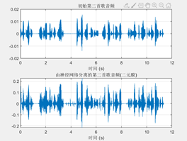

# Audio-separator-based-on-Neural-Network
The MATLAB reproduce of Self-supervised learning Audio separator in paper "Deep Transform: Cocktail Party Source Separation via Complex Convolution in a Deep Neural Network "
## separation method
The input of neural network is the amplitude spectrum of mixed (male + female) audio. The output target of neural network is the ideal soft mask for male speakers. The loss function is to minimize the mean square error between the output and the input target. At the output end, the audio STFT is converted back to the time domain by using the output amplitude spectrum and the phase of the mixed signal, and the self supervised learning method is adopted. The training set is the separation result of ideal soft mask and binary mask in the first 40 seconds of mixed audio, and the network output is the ideal soft mask for male speaker prediction in the second 20 seconds after the verification set is mixed audio.
## Separation results

[result2](result2.png)
